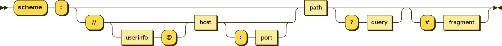

用于便捷输入 URL 的文本框。

## URL 语法

一个 URL 遵从下列语法：

```text
URI = scheme ":" ["//" authority] path ["?" query] ["#" fragment]
```

其中，`authority` 部分的结构为：

```text
authority = [userinfo "@"] host [":" port]
```

整个 URL 可用图表示为：



## API

在 `TextualFormControl` 的基础上新增：

| 属性名 | 值类型/可选值 | 默认值 | 说明 |
| --- | --- | --- | --- |
| `scheme` | `string | string[]` | `'http'` | 使用的方案，详见下方 |
| `noAuthority` | `boolean` | `false` | 是否没有 `authority` 部分，详见下方 |

### `scheme`

值为 `string` 时在文本框前添加固定文本前缀，而值为 `string[]` 时会在文本框前添加前缀下拉列表。

被添加的前缀是 `{scheme}:` 形式——假如 scheme 的值是 `'http'`，则前缀是 `'http:'`。

### `noAuthority`

值如果是 `false`，会在由 `scheme` 生成的前缀后面再加上 `//`。

也就是说，若 `scheme` 的值是 `'http'` 且 `noAuthority` 的值是 `false`，最终生成的前缀是 `'http://'`。
